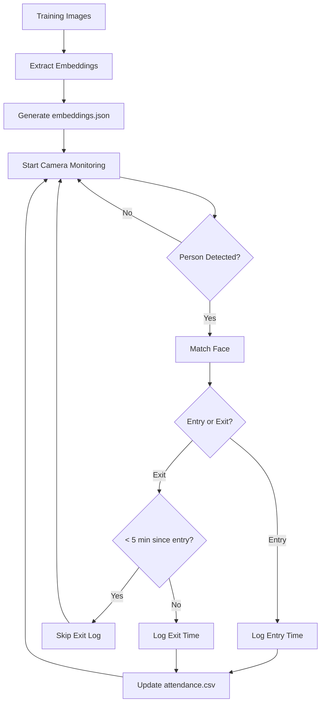

# 📷 Biometric Face Attendance System

## Author: **Abhishek Singh** | Vellore Institute of Technology, Chennai*
<div align="center">


**A real-time facial recognition-based attendance logging system**


</div>

---

## 📝 Introduction

Welcome to the **Biometric Face Attendance System** - a cutting-edge, real-time facial recognition solution for attendance tracking! This intelligent system logs entry and exit times using dual cameras, smartly manages short-duration breaks, and provides an intuitive Streamlit dashboard for attendance visualization.

Perfect for educational institutions, offices, and organizations looking to modernize their attendance tracking with advanced face recognition technology.

## 🚀 Key Features

### 🧠 **Intelligent Face Recognition**
- Seamless identity detection using advanced facial feature analysis
- High accuracy recognition with real-time processing

### 🎥 **Dual-Camera Architecture** 
- **Entry Camera**: Monitors incoming personnel
- **Exit Camera**: Tracks departures
- Perfect for gates, classrooms, or office entrances

### ⏳ **Smart Break Management**
- Intelligent algorithm that doesn't log exit if person returns within **5 minutes**
- Prevents false absence marking for short breaks

### 📊 **Interactive Dashboard**
- Beautiful Streamlit-powered web interface
- Real-time attendance visualization and analytics
- Comprehensive logs and trend analysis

### 🧾 **Automated Logging**
- Automatic CSV export with timestamps
- Structured data storage for easy analysis

### 📱 **Mobile Integration**
- Use Android phones as wireless webcams via **DroidCam**
- Cost-effective dual-camera setup

---

## 🛠️ Technologies Stack

| Technology | Purpose | Version |
|------------|---------|---------|
| **Python** | Core scripting and logic | 3.8+ |
| **OpenCV** | Real-time video processing | 4.x |
| **face_recognition** | Face encoding and detection | Latest |
| **Streamlit** | Web dashboard interface | 1.x |
| **Pandas** | Data manipulation | Latest |
| **NumPy** | Numerical computations | Latest |
| **DroidCam** | Mobile camera integration | Latest |

---

## 📂 Project Structure

```
biometric-attendance-system/
├── 📁 dataa/
│   └── 📁 faces/              # Training images (organized by name)
├── 📄 embeddings.json         # Generated face embeddings
├── 📄 attendance.csv          # Attendance logs with timestamps
├── 📁 scripts/               # Executable Python scripts
│   ├── extract_embeddings.py
│   ├── ml4.py
│   └── streamlit2.py
├── 📁 results/               # Output files
├── 📁 logs/                  # System logs
├── 📁 models/                # ML models
├── 📁 notebooks/             # Jupyter notebooks
├── 📄 .gitignore
└── 📄 requirements.txt       # Dependencies
```

---

## 📥 Installation & Setup

### 🔹 **Step 1: Clone Repository**
```bash
git clone https://github.com/your-username/biometric-attendance-system.git
cd biometric-attendance-system
```

### 🔹 **Step 2: Install Dependencies**
```bash
pip install -r requirements.txt
```

### 🔹 **Step 3: Prepare Training Data**
Create individual folders for each person inside `dataa/faces/`:

```
dataa/faces/
├── Abhishek/
│   ├── 1.jpg
│   ├── 2.jpg
│   └── 3.jpg
├── Ananya/
│   ├── 1.jpg
│   ├── 2.jpg
│   └── 3.jpg
└── ...
```

> **💡 Tip**: Use clear, well-lit face images for better recognition accuracy

### 🔹 **Step 4: Generate Face Embeddings**
```bash
python scripts/extract_embeddings.py
```

### 🔹 **Step 5: Start Attendance Logging**
```bash
python scripts/ml4.py
```

### 🔹 **Step 6: Launch Dashboard**
```bash
streamlit run scripts/streamlit2.py
```

Open your browser and navigate to the displayed local URL to access the dashboard.

---

## 📱 Setting Up DroidCam for Dual Cameras

Since this project requires **two live camera feeds**, you can use your smartphone as a wireless webcam:

### 📲 **Android Setup**
1. **Download DroidCam**: [Google Play Store](https://play.google.com/store/apps/details?id=com.dev47apps.droidcam)
2. Install and launch the app on your phone

### 💻 **Windows Client Setup**
1. **Download DroidCam Client**: [Windows Client](https://droidcam-client.en.uptodown.com/windows)
2. Install and run the client on your PC

### 🌐 **Connection Setup**
- Ensure both PC and phone are on the **same Wi-Fi network**
- Your PC will detect phone cameras (e.g., Camera 0 and Camera 1)
- Configure one camera for entry, another for exit

---

## 🧾 .gitignore Configuration

```gitignore
# Training data and generated files
dataa/faces/
embeddings.json

# Python cache
__pycache__/
*.pyc
*.pyo

# Project directories
logs/
results/
models/output/

# Development files
.ipynb_checkpoints/
venv/
.env/
.vscode/
.idea/

# OS files
.DS_Store
Thumbs.db
```

---

## 📌 How It Works



### 🔄 **Process Flow**:
1. **Training Phase**: Face images stored per person in `dataa/faces/`
2. **Embedding Generation**: `extract_embeddings.py` creates face encodings
3. **Real-time Monitoring**: `ml4.py` monitors entry/exit via dual cameras
4. **Smart Logging**: Exit times < 5 minutes are treated as breaks (not logged)
5. **Dashboard Visualization**: `streamlit2.py` displays attendance analytics

---

## 🤝 Contributing

We welcome contributions! Here's how you can help:

1. **🍴 Fork** the repository
2. **🌿 Create** a new branch: `git checkout -b feature-enhancement`
3. **💾 Commit** your changes: `git commit -m "Added new feature"`
4. **🚀 Push** to branch: `git push origin feature-enhancement`
5. **📬 Open** a Pull Request

### 🐛 **Bug Reports & Feature Requests**
Please use the [Issues](https://github.com/your-username/biometric-attendance-system/issues) tab to report bugs or request features.

---

## 📊 Screenshots


---

## 📜 License

This project is licensed under the **MIT License** - see the [LICENSE](LICENSE) file for details.

---

## 📬 Contact & Support

<div align="center">

### 👨‍💻 **Developer**: Abhishek Singh
### 🏫 **Institution**: Vellore Institute of Technology, Chennai

[](mailto:abhi11.sbsm@gmail.com)
[](https://github.com/abhishek-7-singh/biometric-attendance-system)

</div>

---

<div align="center">

### 🌟 **Star this repository if you found it helpful!** 🌟

*Made with ❤️ for the open-source community*

</div>
